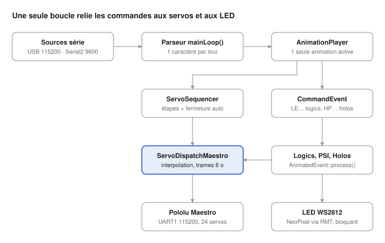
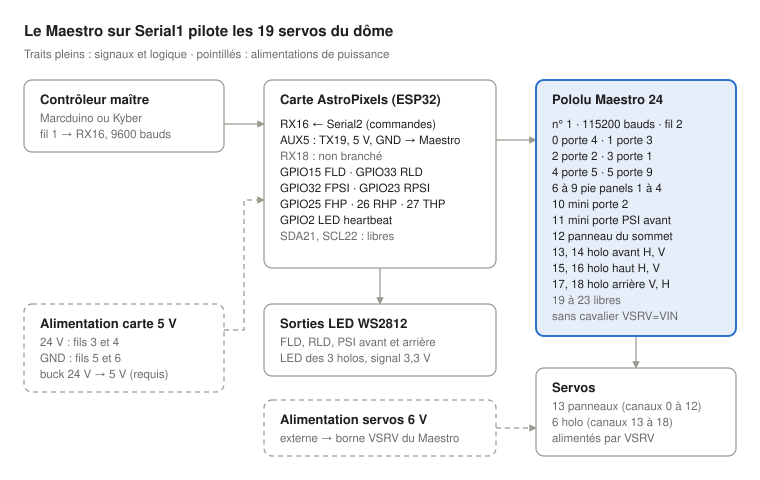

# Revue firmware AstroPixelsPlus

27 septembre 2026 · stefe2

> Le sketch `AstroPixelsPlus.ino` est devenu `src/main.cpp` après la revue ; les numéros de ligne ci-dessous sont ceux de `src/main.cpp`.
>
> L'état des corrections est suivi dans [TODO.md](../../TODO.md). Cette revue décrit le code tel qu'il était au commit 41139a9.
>
> Copie locale du document [Revue firmware AstroPixelsPlus](https://claude.ai/artifact/Tv9Uyd2ehb38JZWfKz8SkY). La version en ligne fait foi si les deux divergent.

Le firmware est simple et sans risque mémoire ou de concurrence, mais cinq défauts fonctionnels et matériels sont à corriger avant de le considérer robuste. Revue statique du commit 41139a9 (+ modifications locales), compilée sans warning avec -Wall -Wextra.

## A. Résumé exécutif

Tout tourne dans une seule boucle coopérative : aucune tâche FreeRTOS ajoutée, aucune ISR utilisateur, aucun réseau (Wi-Fi désactivé à la compilation) et très peu d'allocations dynamiques. Les risques mémoire et de concurrence sont donc faibles. Le comportement attendu sur 24 h, 7 jours et 30 jours est stable (déduction, à mesurer).

Les vrais risques sont fonctionnels et liés au matériel :

1. **Code servo hors contrôle de version.** `ServoDispatchMaestro.h` et les correctifs de `ServoDispatch.h` et `HoloLights.h` vivent dans `.pio/libdeps/`, ignoré par git. Un nettoyage ou un nouveau clone les efface et le build casse. *(Une sauvegarde est maintenant versionnée dans `patches/reeltwo/`.)*
2. **La commande « désactiver servo » (0x60) n'existe pas dans le protocole Pololu.** Les servos deviennent mous, très probablement parce que le Maestro coupe toutes les sorties sur erreur de protocole. Les holos envoient cette commande invalide 6 fois par seconde, sans fin.
3. **Les commandes `:OPxx` refermeraient les panneaux environ 200 ms après l'ouverture.** Le filet de sécurité de fin de séquence ferme tout, quelle que soit la séquence.
4. **Une commande terminée par CR+LF s'exécute deux fois.** Régression du commit 41139a9.
5. **Une seule commande peut faire planter le CPU** (`LE…` avec l'effet 105) : lecture hors limites d'un tableau de pointeurs de fonctions.

## B. Architecture actuelle

Le composant en couleur, `ServoDispatchMaestro`, concentre la plupart des problèmes. Les holos pilotent aussi leurs servos via ce dispatch (flèche horizontale).

**Démarrage.** Les constructeurs globaux créent les LogicEngine, les 3 HoloLights, `servoDispatch`, `servoSequencer`, `player`, et environ 200 objets `Marcduino` (un par commande). Ensuite `setup()` :

1. `REELTWO_READY()` (Serial à 115200) et ouverture des Preferences `"astro"` ;
2. Serial2 à 9600 baud (RX 16, TX 17), LED sur GPIO 2, Serial1 à 115200 vers le Maestro (TX 19) ;
3. `SPIFFS.begin(true)`, puis `SetupEvent::ready()` qui appelle `setup()` sur tous les modules ;
4. texte défilant sur les logics, affectation des servos holo 13–18, sélecteur d'effets personnalisé.

**Fonctionnement normal.** `loop()` appelle `mainLoop()` : heartbeat LED toutes les 500 ms, `AnimatedEvent::process()` sur tous les modules, puis lecture d'un seul caractère sur USB et un seul sur Serial2. Sur CR ou LF, `Marcduino::processCommand()` cherche un préfixe correspondant et appelle `player.animateOnce()`. L'action s'exécute au tour suivant. Toute nouvelle commande interrompt l'animation en cours et lance son `DO_RESET`.

## C. Carte des ressources ESP32

Cible : ESP32 classique (`board = esp32dev`, module ESP32-WROOM-32 sur DevKit 30 broches), double cœur à 240 MHz, flash 4 Mo QIO à 80 MHz. PSRAM non utilisée. Framework arduino-esp32 2.0.5 (IDF 4.4.2), plateforme espressif32 5.2.0, GCC 8.4.0.

| Ressource | Utilisation |
| --- | --- |
| Tâches | `loopTask` : cœur 1, priorité 1, stack 8192 o. Seulement les tâches système IDF en plus. `eventLoopTask` non compilée (`USE_WIFI` non défini) |
| ISR | Aucune écrite par le projet. ISR des pilotes UART et RMT |
| Timers, LEDC, SPI, I2C | Non utilisés (`Wire.begin()` non appelé en mode Maestro) |
| RMT | Un canal installé puis désinstallé à chaque `show()` (Adafruit NeoPixel, chemin IDF4) |
| UART0 | Console USB 115200, RX 256 o |
| UART1 | Maestro : TX GPIO19, RX GPIO18, 115200 8N1, TX buffer 0 (écriture bloquante dès que la FIFO de 128 o est pleine) |
| UART2 | Commandes Marcduino : RX16, TX17, 9600 8N1, RX 256 o |
| Mémoire | RAM statique 25 828 o (7,9 %), flash 385 705 o (29,4 % de 1,25 Mo) |
| Stockage | NVS (écrit seulement par `#APZERO`, `#APWIFI`). SPIFFS monté mais jamais lu |
| Watchdogs | TWDT 5 s sur IDLE0 seulement. `loopTask` et IDLE1 non surveillés. Brownout niveau 0 |
| Réseau | Aucun à la compilation |

| GPIO | Dir. | Fonction | Remarque |
| --- | --- | --- | --- |
| 2 | Sortie | LED heartbeat | Strapping : bas ou flottant pour le mode téléchargement. Relié aussi au connecteur AUX1 |
| 15 | Sortie | Données FLD | Strapping (pull-up au boot), scintillement possible |
| 33 | Sortie | Données RLD | — |
| 32, 23 | Sortie | PSI avant, arrière | — |
| 25, 26, 27 | Sortie | Holo avant, arrière, haut | — |
| 16, 17 | Entrée, sortie | Serial2 Marcduino | Contrôleur maître en 3,3 V (confirmé) |
| 19, 18 | Sortie, entrée | Serial1 Maestro | RX18 non branché |
| 4, 5, 21, 22 | — | Non utilisés | GPIO 5 = strapping, libre |

### Schéma de câblage actuel

L'ancien schéma `docs/wiring/wiring-original-pca9685.png` montre encore les deux PCA9685 en I2C. Ce schéma-ci décrit la configuration Maestro. Il combine le code, le brochage du câble du dôme, la photo `docs/wiring/wiring-maestro.png` et les précisions sur l'alimentation. Détails dans [hardware.md](../hardware.md).

Le fil 2 relie AUX5 (GPIO19) au RX du Maestro ; AUX5 fournit aussi VIN et GND à la logique du Maestro. Le TX du Maestro n'est pas branché. Les servos ont leur propre alimentation 6 V sur VSRV, sans cavalier VSRV=VIN.

D'après la [documentation AstroPixels](https://r2djp.gitbook.io/astropixels/getting-started/power) (r2djp), la carte n'a **aucun régulateur** : elle attend du 5 V régulé (4,8 à 5,25 V, jamais plus de 5,5 V), au moins 2 A et 3 A recommandés. Le 24 V du câble passe donc forcément par un convertisseur buck dans le dôme. Conséquences pour ce montage :

- La broche V d'AUX5 est le rail 5 V : le Maestro tourne au minimum de sa plage VIN (5 à 16 V). Les mesures ne montrent aucune baisse, donc c'est acceptable, mais il n'y a pas de marge.
- AUX1 est relié à GPIO2 ([brochage](https://r2djp.gitbook.io/astropixels/advanced-and-customisation/overview)) : la LED heartbeat clignote aussi sur ce connecteur. Ne rien y brancher qui réagisse à un signal de 1 Hz.
- Les 269 LED (RLD 108, FLD 90, PSI 2 × 25, holos 3 × 7) confirment l'estimation du problème 7 : environ 8 ms de transmission bloquante quand toutes les chaînes se rafraîchissent.

À noter : `rearHolo.assignServos(&servoDispatch, 17, 18)` déclare 17 horizontal et 18 vertical, alors que la table des servos dit l'inverse. Les axes du holo arrière sont probablement inversés (à vérifier sur le matériel).

## D. Points forts à conserver

- **Une seule boucle coopérative** : aucun mutex ni race condition possible entre modules. C'est le bon choix pour ce projet.
- **Quasiment pas de heap dans le chemin courant** : buffers statiques, pas de `String` dans la boucle, `new`/`delete` seulement au changement d'effet logic, avec des destructeurs corrects.
- Les machines à états `HoloLEDAnimator` et `HoloAliveAnimator` sont non bloquantes et lisibles.
- Le heartbeat utilise `now - last >= 500` : correct au rollover de `millis()`, et bon indicateur visuel de gel.
- `numberparams` et les buffers de console sont bornés (`sPos < size-1`).
- Le correctif `fLastIsFinished` et la condition `fActive && fCurrentPos == pos` sont bien raisonnés et documentés.
- **Aucun warning** à la compilation, même avec `-Wall -Wextra`.

## E. Problèmes identifiés

Deux problèmes critiques, six importants, six de moindre portée. Les numéros sont repris dans le plan d'action.

| N° | Sévérité | Problème | Où |
| --- | --- | --- | --- |
| 1 | CRITIQUE | Code servo hors contrôle de version | `.pio/libdeps/…/Reeltwo/src` |
| 6 | CRITIQUE | Lecture hors limites, plantage sur une commande | `src/main.cpp:637` |
| 2 | IMPORTANT | Commande Maestro 0x60 invalide pour désactiver | `ServoDispatchMaestro.h:240`, `:325` |
| 3 | IMPORTANT | Holos : `disable()` renvoyé chaque seconde | `src/main.cpp:132-153` |
| 4 | IMPORTANT | Fermeture auto après `:OPxx` | `src/main.cpp:577-586` |
| 5 | IMPORTANT | Double exécution sur CR+LF | `src/main.cpp:1348-1381` |
| 7 | IMPORTANT | Un seul caractère lu par tour | `src/main.cpp:1348`, `:1363` |
| 8 | IMPORTANT | Boucle principale sans watchdog | `setup()` |
| 9 | AMÉLIORATION | Débit UART du Maestro | `ServoDispatchMaestro.h:95-151` |
| 10 | AMÉLIORATION | Rollover de `millis()` après 49,7 jours | plusieurs fichiers |
| 11 | AMÉLIORATION | Impulsions non bornées | `MarcduinoPanel.h:58-106` |
| 12 | AMÉLIORATION | Heap et RMT à chaque `show()` | Adafruit NeoPixel `esp.c` |
| 13 | COSMÉTIQUE | Code mort, doublons, macros mal utilisées | plusieurs fichiers |
| 14 | AMÉLIORATION | `@1P60`/`@1P61`/`@2P60`/`@2P61` déclenchent le PSI Leia | `src/MarcduinoLogics.h`, `src/MarcduinoPSI.h` |

### 1. CRITIQUE — Code servo hors contrôle de version

`git status` dans `.pio/libdeps/astropixelsplus/Reeltwo` montre `ServoDispatchMaestro.h` non suivi, et `ServoDispatch.h` (ajout de `setSequenceActive`) et `HoloLights.h` (`fCounter = millis()`) modifiés. Or `.gitignore` contient `.pio`. Un nouveau clone, un nettoyage ou une vérification d'intégrité PlatformIO efface le driver Maestro et le build casse. On ne peut pas non plus prouver que `firmware/*.bin` correspond au dépôt. Autre point : `Adafruit_NeoPixel` et `DFRobotDFPlayerMini` ne sont pas épinglés.

**Correction :** déplacer les trois fichiers dans le projet (`lib/ReeltwoLocal/` ou un fork de Reeltwo référencé par tag) et épingler toutes les lib_deps. En attendant, une sauvegarde versionnée est dans `patches/reeltwo/`.

### 2. IMPORTANT — Commande « disable » Maestro invalide

`disable()` et `stop()` écrivent `0xAA, 0x01, 0x60, ch, 0, 0`. Le protocole Pololu ne connaît pas 0x60 (Set Target = 0x04, Set PWM = 0x0A…). La documentation Pololu indique qu'un target de 0 arrête les impulsions, contrairement à ce que dit le TODO (lignes 402-404).

Déduction : le Maestro lève une *Serial protocol error* (bit 0x0010, LED rouge). Si les canaux sont réglés « On startup or error = Off », tous les canaux coupent leurs impulsions, pas seulement celui visé. `:SD<n>` couperait donc tout.

**Correction :** envoyer `0xAA, dev, 0x04, ch, 0x00, 0x00`. **Validation :** Get Errors (`0xAA 0x01 0x21`) doit rendre 0. À vérifier sur le matériel.

### 3. IMPORTANT — Holos : `disable()` renvoyé chaque seconde

Après `disable()`, `fStopDelayMS = 0` ; au tour suivant la condition `!holoServosActive && fStopDelayMS == 0` est vraie et un nouveau délai part. Résultat : 6 trames invalides par seconde, en permanence.

Combiné au n° 2 (déduction), toutes les sorties seraient coupées chaque seconde, y compris un panneau en mouvement. Cela correspond aux symptômes du TODO : « speed=0 non fiable », « speed=100 inconsistant ». Les mouvements interpolés survivent car chaque nouvelle cible relance les impulsions.

**Correction :** programmer l'arrêt seulement sur la transition actif → inactif.

### 4. IMPORTANT — Fermeture automatique après une ouverture

`SeqPanelAllOpen` n'a qu'une étape de 20 cs. Environ 200 ms après `play()`, `isFinished()` devient vrai et déclenche `moveServosTo(ALL_DOME_PANELS_MASK, 125, 0.0)`, c'est-à-dire la position fermée. Touche `:OP00`, `:OP01`…`:OP20`, `:OP$…` et `$720` (Yoda). Ensuite `stop()` coupe les 24 canaux après 1,5 s, holos compris. `:OP00` avait été validé avant l'ajout du filet (étape 8c), pas après.

**Correction :** fermer seulement pour les séquences qui doivent finir fermées (paramètre `closeOnFinish`), ou retirer le filet et s'appuyer sur `:CL00`. Déduction, à vérifier sur le matériel.

### 5. IMPORTANT — Double exécution sur CR+LF

Sur `\n` après `\r`, `sPos == 0` mais `sBuffer` contient toujours l'ancienne commande, qui est relancée. L'ancien `MarcduinoSerial` avait la garde `if (*fBuffer != '\0')` ; le commit 41139a9 l'a perdue. Effet : exécution, `DO_RESET`, puis relance.

**Correction :** `if (sPos > 0) { sBuffer[sPos] = 0; processCommand(…); } sPos = 0;` sur les deux ports.

### 6. CRITIQUE — Lecture hors limites dans `CustomLogicEffectSelector`

La condition `selectSequence - 100 <= SizeOfArray(sCustomLogicEffects)` accepte l'index 5 sur un tableau de 5. La commande `~RTLE11050000` donne l'effet 105 : un pointeur de fonction arbitraire est lu puis appelé, d'où exception et reboot.

**Correction :** remplacer `<=` par `<`.

### 7. IMPORTANT — Un seul caractère lu par tour de boucle

`if (available())` au lieu de `while`. Chaque tour inclut les `show()` NeoPixel bloquants (RLD 108 LED ≈ 3,2 ms, FLD 90 ≈ 2,7 ms) et les écritures Maestro. Si un tour dure 8 ms (déduction), on lit 125 caractères/s contre 960/s à 9600 baud. Une rafale de plus de 256 caractères déborde le buffer RX.

**Correction :** `while (available())`, borné à environ 64 caractères par tour.

### 8. IMPORTANT — Aucun watchdog sur la boucle principale

Le sdkconfig de 2.0.5 ne surveille pas IDLE1, et `enableLoopWDT()` n'est pas appelé. Un blocage donne un gel silencieux, sans reset ; seul le heartbeat le révèle.

**Correction :** appeler `enableLoopWDT()` dans `setup()`.

### 9. AMÉLIORATION — Débit UART du Maestro

Chaque tour, chaque servo en mouvement envoie 6 octets : 13 panneaux = 78 octets, environ 6,8 ms à 115200 baud. Au-delà de 128 octets, `write()` bloque. À mesurer avant de changer ; pistes : limiter à 50 Hz par servo, Set Multiple Targets (0x1F), ou `Serial1.setTxBufferSize(256)`.

### 10. AMÉLIORATION — Rollover de `millis()`

`millis() >= deadline` (`src/main.cpp` lignes 145, 336, 398, 589) et `currentTime < fMoveStartTime` (`ServoDispatchMaestro.h:102`, `:113`). Après 49,7 jours, un servo peut rester figé ou un holo arrêter de bouger. **Correction :** `(int32_t)(now - deadline) >= 0`.

### 11. AMÉLIORATION — Impulsions non bornées

`:SQ`, `:SM`, `:SL` convertissent `int32` en `uint16` sans limite à `fMinimum`/`fMaximum`. Une valeur hors plage peut forcer un panneau, sauf limites configurées dans le Maestro. Aussi : `(uint16_t)(delta * completion)` avec un `delta` négatif est un comportement indéfini ; utiliser `(int32_t)`.

### 12. AMÉLIORATION — Heap et RMT à chaque `show()`

`esp.c` installe et désinstalle le pilote RMT à chaque trame (environ 5 bandes à 100 Hz). Allocations de même taille, donc faible risque de fragmentation, mais coût CPU. Mesurer le heap minimum sur 24 h avant de conclure.

### 13. COSMÉTIQUE — Maintenance

- `:SE36` et `:SE56` utilisent `DO_SEQUENCE_VARSPEED` dans un `MARCDUINO_ACTION` : la séquence est lancée deux fois. Utiliser `SEQUENCE_PLAY_ONCE_VARSPEED`.
- `:CL00` appelle `processCommand(player, "@4S3")` : aucune commande `@4S…` n'existe. Code mort.
- `@1T1` correspond aussi à `@1T11` ; ça marche seulement parce que la dernière correspondance l'emporte.
- `SPIFFS.begin(true)` monté sans usage (formate au premier boot) ; `-mfix-esp32-psram-cache-issue` inutile sans PSRAM.
- Environ 350 lignes copiées-collées pour les handlers `:OX$` ; gros blocs commentés ; `MarcduinoSound.h`, `WebPages.h` et `BitmapEffect` inactifs.

### 14. AMÉLIORATION — Commandes de police des logics avant inopérantes

`Marcduino::processCommand()` teste toutes les commandes par préfixe et garde la dernière qui correspond. `@1P6` (PSI avant en Leia) est un préfixe de `@1P60` et `@1P61`, et il est déclaré après eux (`MarcduinoPSI.h` est inclus après `MarcduinoLogics.h`). `@1P60` lance donc le PSI Leia au lieu de changer la police. Même chose pour `@2P60`/`@2P61` avec `@2P6`. `@3P60`/`@3P61` fonctionnent.

**Correction :** donner aux commandes de police un préfixe qui n'en contient pas d'autre, ou faire gagner la correspondance la plus longue dans le parseur.

## F. Risques matériels

- **Mode « On startup or error » des 24 canaux** dans Maestro Control Center : c'est la clé des problèmes 2 et 3. *À vérifier.*
- **Limites min/max par canal dans le Maestro** : seule protection contre `:SM` et `:SQ` hors plage. *À vérifier.*
- **Niveau logique sur GPIO16 (RX Serial2) (confirmé) :** le contrôleur maître sort du 3,3 V, compatible avec l'ESP32. Risque écarté.
- **RX16 flottant quand rien n'est branché** : un octet `0x0D` parasite exécuterait une commande. *Corrigé : rappel au niveau haut sur GPIO 16.*
- **Données WS2812 en 3,3 V (confirmé) :** la carte n'a ni adaptateur de niveau ni protection ; les GPIO attaquent directement les LED alimentées en 5 V. Aucun scintillement observé, donc aucune action nécessaire. Précaution : ne pas brancher ou débrancher les câbles LED sous tension, car un GPIO non protégé peut être détruit par un court-circuit ou un contact avec le 5 V.
- **GPIO 15 et 2 (strapping)** : état des LED au boot, et flashage possible avec les câbles branchés.
- **Alimentations (confirmé et mesuré) :** servos sur une alimentation externe 6 V branchée sur la borne VSRV du Maestro, sans cavalier VSRV=VIN ; logique du Maestro alimentée par le connecteur AUX5. Le courant des servos ne passe pas par le rail de l'ESP32. Mesures faites le 27 septembre 2026 : aucune baisse de tension sur le rail V d'AUX5 ni sur l'alimentation 6 V, y compris quand les 13 panneaux démarrent ensemble. Risque écarté.

## G. Performance et mémoire

Le CPU est dominé par les `show()` NeoPixel bloquants et l'UART du Maestro ; la mémoire n'est pas un sujet.

| Domaine | Évaluation |
| --- | --- |
| CPU | Cœur 0 presque inactif. Calculs flottants de l'interpolation négligeables |
| Heap | Environ 290 Ko libres (déduction). Allocations seulement au changement d'effet logic et dans le pilote RMT. Pas de `String` dans la boucle |
| Stack | `loopTask` 8 Ko, peu de variables locales. Risque faible, non mesuré |
| PSRAM | Aucune utilisée, aucun besoin |
| Fragmentation | Faible (déduction) |
| Timing | Période de boucle inconnue ; elle fixe la latence série et la fluidité des servos. Première chose à mesurer |

## H. Robustesse long terme

Aucune fuite ni compteur à risque identifié avant 49,7 jours ; rien n'est encore mesuré.

- **24 h et 7 jours :** comportement stable attendu (déduction), hormis l'erreur de protocole Maestro permanente des problèmes 2 et 3.
- **30 jours :** idem. Le rollover de `millis()` n'arrive qu'à 49,7 jours.
- **Au-delà de 49,7 jours :** gels possibles de servos ou de holos (problème 10).

**Instrumentation recommandée**, par exemple une commande `#APSTAT` qui affiche :

- uptime et `esp_reset_reason()` ;
- `ESP.getFreeHeap()`, `ESP.getMinFreeHeap()`, `heap_caps_get_largest_free_block(MALLOC_CAP_8BIT)` ;
- `uxTaskGetStackHighWaterMark(NULL)` ;
- période de boucle maximale et moyenne ;
- nombre de débordements du buffer série ;
- erreurs Maestro (Get Errors).

## I. Plan de tests sur le matériel

Les trois premiers tests confirment ou infirment les déductions des problèmes 2, 3 et 4.

| Test | Procédure | Résultat attendu | À observer |
| --- | --- | --- | --- |
| Erreurs Maestro | Repos 10 s, puis Get Errors | 0x0000, LED rouge éteinte | Bit 0x0010 (protocole) |
| `:OP00` | Envoyer `:OP00`, attendre 5 s | Panneaux restent ouverts | Refermeture vers 200 ms ? |
| `:SD5` | Désactiver un canal | Seul le canal 5 devient mou | Les autres tiennent-ils ? |
| CRLF | Moniteur USB en NL+CR, envoyer `:SE02` | Une seule exécution | Log `[Serial2]` en double, séquence relancée |
| Rafale série | 20 commandes collées sur Serial2 | Toutes exécutées | Commandes perdues, période de boucle |
| Effet 105 | `~RTLE11050000`, après correction seulement | Pas de reboot | `esp_reset_reason` |
| Reboots répétés | 50 cycles d'alimentation | Boot à chaque fois, panneaux immobiles | Mouvements parasites, LED au boot |
| Brownout | 13 panneaux ensemble (`:SE31`), alimentation limite | Fait : aucune baisse de tension | Reset reason = BROWNOUT |
| Serial2 débranché | Retirer le câble 1 h | Aucune commande fantôme | Log `[Serial2]` |
| Endurance | 72 h, une séquence aléatoire toutes les 30 s | Heap minimum stable, pas de gel | Heartbeat, `#APSTAT` chaque heure |

## J. Plan d'action

Commencer par versionner le code servo : sans cela, aucune autre correction n'est durable.

| Ordre | Action | Problèmes | Fichiers | Difficulté | Risque | Validation |
| --- | --- | --- | --- | --- | --- | --- |
| 1 | Versionner les modifs Reeltwo, épingler les lib_deps | 1 | `platformio.ini`, `lib/` | Faible | Nul | Clone neuf puis `pio run` |
| 2 | Target 0 pour `disable`/`stop`, transition dans `HoloLightsWithAutoStop` | 2, 3 | `ServoDispatchMaestro.h`, `.ino` | Faible | Moyen (le comportement « mou » change) | Tests Erreurs Maestro et `:SD5`, puis retester speed=0 et 100 |
| 3 | Filet de sécurité seulement pour les séquences fermantes | 4 | `.ino` | Faible à moyenne | Faible | `:OP00`, `$720`, `:SE22` |
| 4 | Parseur série : garde du buffer vide, `while` borné | 5, 7 | `.ino` (`mainLoop`) | Faible | Faible | Tests CRLF et rafale |
| 5 | `<=` → `<` dans `CustomLogicEffectSelector` ; commandes de police | 6, 14 | `.ino`, `src/` | Triviale à faible | Nul à faible | Test effet 105, `@1P61` |
| 6 | `enableLoopWDT()` et commande `#APSTAT` | 8 | `.ino` | Faible | Faible | Endurance 72 h |
| 7 | Bornage des impulsions, comparaisons sûres au rollover | 10, 11 | `.ino`, `ServoDispatchMaestro.h` | Faible | Faible | `:SM` hors plage |
| 8 | Réduire le débit Maestro, si les mesures le justifient | 9 | `ServoDispatchMaestro.h` | Moyenne | Moyen | Période de boucle avant et après |
| 9 | Nettoyage | 13 | plusieurs | Faible | Faible | Compilation, séquences inchangées |

Les conclusions sur le mécanisme exact des problèmes 2 et 3 sont des déductions ; les tests de la section I les tranchent.
